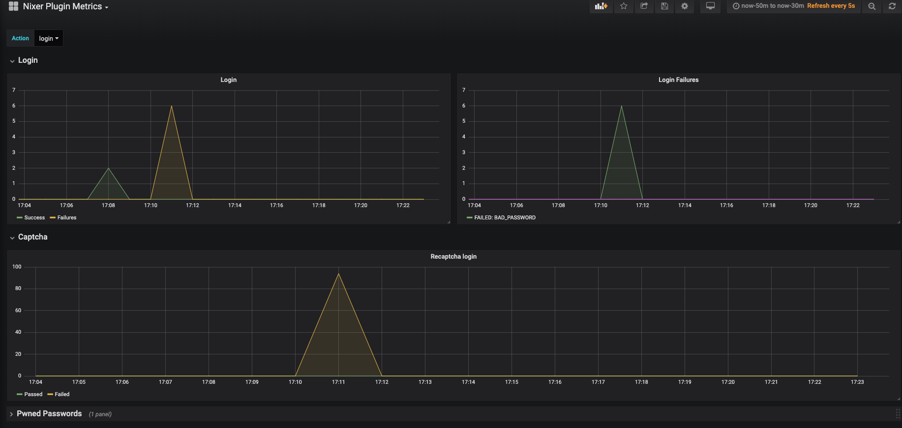
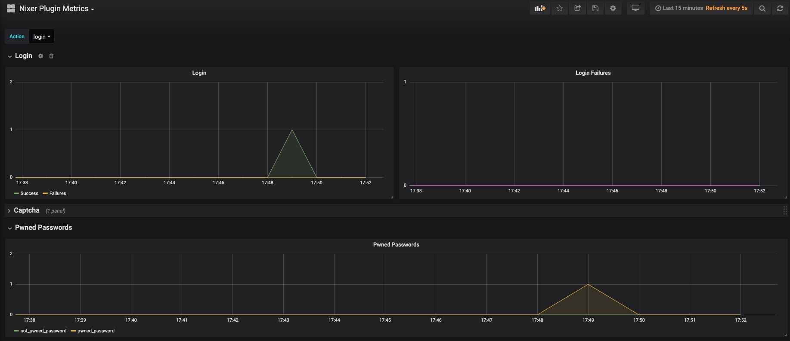

# E2E Test
This module contains e2e tests based on postman simulating variety of cases for user login.

## Running
Tests are created with Postman and could be run both with Postman app or in command line using Newman.
### Postman App
Prior running any test add `localhost` to cookies whitelist.

 - import test collection
 - select test data file
 - run

### Newman
Newman is command line runner for Postman collections.
Prior running any test install dependencies:
```
npm install
```
To run tests perform
```
node <test-name>.js
```
That will output results to stdout

To save results as html report add `--reporter=html` in `test-results` directory.

## Test Suites
### Regular user
Test cases:
- User logs in and Logs out 
- User forget password (tries to login with wrong password few times)
- User mistyped password once and then used correct password

To run test execute: 
    ```
    node test-regular-users.js
    ```

### Brute force attack
This test simulates brute-force by sending multiple invalid login requests for same username using unique IP addresses.


**Using multiple ip addresses to sent requests is achieved using forwarding headers.**

- To run test execute: 
    ```
    node test-bruteforce.js
    ```
- Expected behavior:  
    After processing first x failed login attempts `usernameLoginOverThreshold` will trigger captcha for subsequent login requests with same username. 
    With captcha challenge enabled subsequent call will fail due to invalid captcha response. 

Grafana dashboard


### Single IP Random UserAgent CS attack
This test simulates attacker sending many login request with unique combos from single IP.

Test uses randomized `UserAgent` similar to what CS do.

- To run test execute:
    ```
    node test-cs.js
    ```
- Expected behavior:  
After processing first x failed login attempts `ipLoginOverThreshold` will trigger captcha for subsequent login requests with same IP. 
With captcha challenge enabled subsequent calls will fail due to invalid captcha response. 

### Multiple IP limited UserAgents CS attack
This test simulates attacker sending many login request with unique combos from multiple IP but small useragent pool.

Test uses randomized `IP` similar to what distributed CS would do.

- To run test execute:
    ```
    node test-cs-user-agent.js
    ```
- Expected behavior:  
After processing first x failed login attempts `userAgentLoginOverThreshold` will trigger captcha for subsequent login requests with same `UserAgent`. 
With captcha challenge enabled subsequent calls will fail due to invalid captcha response.

### IP Filtering
This test simulates attacker using cloud IP to perform attack. 

Test uses `IP` that belongs to IP range which is consider suspicious or having bad reputation.

- To run test execute:
    ```
    node test-ip-filter.js
    ```
- Expected behavior:  
    After positive match against ip collection, rule will trigger captcha for request originating from matched IPs.  
    With captcha challenge enabled subsequent calls will fail due to invalid captcha response.


### Leaked Credentials
Attacked or user attempts to login using leaked credentials.
  
  
- To run test execute:
  ```
  node test-leaked-credentials.js
  ```
- Expected behavior:  
 
  `Pwned Passwords` metric should show match against leaked password db.
  
 - Example Grafana dashboard 
  


